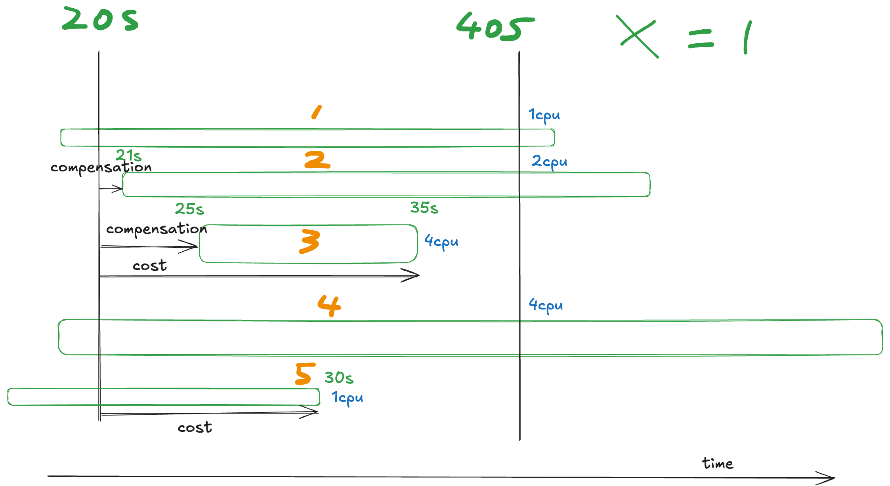

# Main logic

to achieve O(1) time complexity in `get_expenditure`, each user should record the total number of currently active vcpus to calculate the price of running jobs easily.

data structure `list` + `unordered_map<int, list::iterator>` is used for O(1) deletion and O(1) loopup.

# Example
this question should be solved from the perspective of the data centre.

the cost at `timestamp = 40s` is summed up from four parts:
1. the cost at last `timestamp = 20s`,
2. the cost of running vms `running_price`,
    ```C++
    running_price = total_vcpu * X * (40-20);
    ```
3. the cost of finished vms `finished_price` between `timestamp = 20s` and `timestamp = 40s`.
    whenever a job is stopped

    ```C++
    finished_price += vcpu * X * (stop_ts-20);
    ```

4. (negative) the compensation when the vm is not running at `timestamp = 20s`
    whenever a job is started after `timestamp = 20s`

    ```C++
    compensation += vcpu * X * (start_ts-20);
    ```


